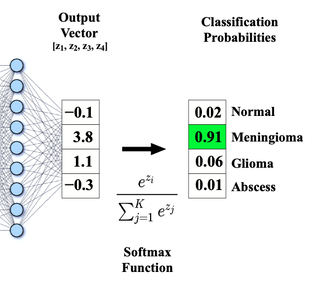

# Introdução 

A função de ativação `Softmax` desempenha um papel importante no mundo de Machine Learning (ML),
portanto, é importante garantir que tenhamos uma base sólida sobre essa função antes de mergulharmos em quaisquer variações
como `LogSoftmax` e `Softmax2D` que serão discutidas neste post do blog.

# Softmax

A função `Softmax` transforma um vetor numerico em um distribuição de propabilidadades,
o que nos garante que os elementos do vetor somarão um e que valores maiores terão probabilidades maiores
mapeando cada valor do vetor a uma probabilidade, 
vale ressaltar que está "probabilidade" funciona como uma normalização do vetor e não como a probabilidade em si.
A `Softmax` normaçmente é utilizada na ultima cada de um Multi Layer Perceptron (MLP), 
Em tarefas de classificação multi-classe junto com a [Cross Entropy Loss](https://machinelearningmastery.com/cross-entropy-for-machine-learning/)
que nos permite fazer [esse](https://levelup.gitconnected.com/killer-combo-softmax-and-cross-entropy-5907442f60ba) truque,
que nos permite simplificar algumas contas no back propagation

# LogSoftmax

`LogSoftmax` é uma operação que combina as funções Softmax e logaritmo natural em uma única etapa. O objetivo principal dessa função é converter logits de um modelo em log-probabilidades. Isso é particularmente útil para melhorar a estabilidade numérica e a eficiência computacional em determinadas operações.

A `LogSoftmax` não é nada mais complexo que $\text{LogSoftmax}(x_i) = \log\left(\frac{e^{x_i}}{\sum_{j}e^{x_j}}\right)
$ porem podemos utilizar propriedades logaritmas para simplificar essas formula, usando a propriedade do quociente, $\log_b \left( \frac{x}{y} \right) = \log_b(x) - \log_b(y)$ podemos simplificar a formula para $\text{LogSoftmax}(x_i) = x_i - \log\left(\sum_{j}e^{x_j}\right)$.

Vantegens
- *Estabilidade Numérica:* Ao trabalhar diretamente com log-probabilidades, evitam-se problemas de underflow e overflow. 
- *Eficiência Computacional:* Combinar as operações de Softmax e log em uma única função permite otimizar os cálculos, reduzindo a quantidade de trabalho computacional necessário. Isso é mais eficiente do que calcular a Softmax e, em seguida, aplicar o logaritmo aos resultados.
- *Prevenção de Erros Numéricos em Modelos Complexos:* Em modelos de deep learning particularmente complexos ou profundos, pequenos erros numéricos podem se acumular ao longo das camadas. Usar LogSoftmax ajuda a prevenir esses acúmulos, contribuindo para a estabilidade geral do treinamento.
- *Modelagem de Sequências:* No PLN, a LogSoftmax é frequentemente usada em modelos de linguagem e outras tarefas de sequência, onde a eficiência e a estabilidade numérica são críticas devido ao grande tamanho do vocabulário e à complexidade dos modelos.

LogSoftmax é amplamente utilizada em tarefas que envolvem classificação e modelagem de linguagem. Por exemplo, em redes neurais recorrentes (RNNs) e modelos de atenção. Em resumo a LogSoftmax transforma os scores brutos dos modelos em valores que podem ser interpretados de forma probabilística, ao mesmo tempo em que oferece vantagens numéricas e computacionais significativas.

# Softmax2D 

A Softmax2D pode ser entendida como uma extensão da operação de Softmax. Enquanto a Softmax padrão é aplicada a vetores, a Softmax2D é projetada para operar em tensores com duas dimensões significativas. Isso a torna particularmente útil em contextos onde as entradas são imagens ou mapas de características em redes neurais convolucionais

Vantagens
*Trabalho com Estruturas Bidimensionais:* A principal vantagem da Softmax2D é sua habilidade de trabalhar diretamente com dados que são naturalmente bidimensionais, preservando a estrutura espacial dos dados.

Considerações ao utilizar Softmax2D, é crucial considerar o impacto computacional, especialmente em matrizes muito grandes, onde a normalização pode se tornar um gargalo se não for otimizada adequadamente.

Em resumo, a Softmax2D estende os princípios da Softmax para domínios onde as entradas são bidimensionais, oferecendo uma ferramenta a normalização de dados em aplicações de visão computacional, processamento de imagens e análise espacial, mantendo a coesão e significância das estruturas bidimensionais nos dados.

# Conclusão

`Softmax` e suas variações são fundamentais no cenário de deep learning, cada variação servindo a seu propósito único em vários domínios. Enquanto a função softmax fornece uma base ao transformar logits em probabilidades interpretáveis, suas variantes como log-softmax trazem vantagens computacionais e estabilidade numérica, especialmente uteis no cálculo de perda e otimização de gradiente. Por outro lado, softmax2d estende o conceito de softmax para dimensões espaciais, abrindo portas para aplicações avançadas de processamento de imagens, como segmentação.

referencias:

https://mriquestions.com/softmax.html
https://pytorch.org/docs/stable/generated/torch.nn.LogSoftmax.html
https://stackoverflow.com/questions/61567597/how-is-log-softmax-implemented-to-compute-its-value-and-gradient-with-better
https://youtu.be/8nm0G-1uJzA?si=tpA4XBsojZciALCB
https://medium.com/@AbhiramiVS/softmax-vs-logsoftmax-eb94254445a2
